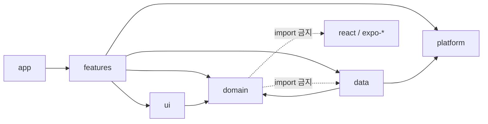

# Verse Keeper — 아키텍처 · 기술 스택 · 폴더 구조 (architecture.md)

> Stage 0 산출물 · 버전은 **2026-09-25에 npm과 expo/expo `sdk-57` 브랜치의 `bundledNativeModules.json`으로 확인**했다. Stage 1에서 `npx create-expo-app` 직후 `npx expo install --check`로 다시 확인한다.

## 1. 기술 스택 타당성 검토 → 확정안

| 영역 | 선택 | 확인한 버전 (2026-09-25) | 판정 · 근거 |
|---|---|---|---|
| 런타임 | Expo SDK **57** | `expo@57.0.25` (`latest` = `sdk-57`) | ✅ 최신 안정. SDK 58은 아직 preview |
| RN / React | React Native **0.86.3**, React **19.2.3** | SDK 57 번들 기준 | ✅ npm 최신은 RN 0.87이지만 **Expo가 고정한 0.86.3을 사용**한다(Expo 모듈 호환) |
| 언어 | TypeScript **~6.0** strict | SDK 57 템플릿 `typescript ~6.0.3` | ✅ npm의 TS 7(Go 네이티브)은 Expo 템플릿이 아직 채택하지 않아 보류 |
| 라우팅 | expo-router | `~57.0.23` | ✅ 파일 기반, 타입 라우트 |
| DB | expo-sqlite (async API) | `~57.0.3` | ✅ WAL, 트랜잭션, `PRAGMA user_version` |
| i18n | expo-localization + i18next + react-i18next | `~57.0.2` / `26.x` / `17.x` | ✅ |
| TTS | expo-speech | `~57.0.3` | ✅ `rate`, `language`, **`onBoundary`(단어 경계)** 확인 → 단어 하이라이트 가능 |
| 알림 | expo-notifications (로컬만) | `~57.0.21` | ✅ `DAILY` 트리거. **config plugin에서 원격 푸시(aps-environment) 설정을 넣지 않는다** |
| 햅틱 | expo-haptics | `~57.0.3` | ✅ |
| 백업 | expo-file-system + expo-sharing + expo-document-picker | `~57.0.7` / `~57.0.22` / `~57.0.2` | ✅ (요구사항 3.5를 구현하려면 필요해서 추가) |
| UUID | expo-crypto `randomUUID()` | Stage 1에서 확인 | ✅ 수출 규정상 "암호화"에 해당하지 않음(난수 생성) |
| 테스트 | jest-expo + @testing-library/react-native | `~57.0.5` / `14.x` | ✅ domain·data는 `node` 환경, UI는 `jest-expo/ios` 프리셋 |
| DB 테스트 | Node 22 내장 `node:sqlite` 어댑터 | Node 22.22 / SQLite 3.51 확인 | ✅ 모킹 대신 실제 SQL로 테스트 (dev 전용) |
| 린트 | ESLint(flat config) + eslint-config-expo + Prettier | `~57.0.2` | ✅ `no-restricted-imports`와 `no-restricted-globals`로 금지사항 강제(§4) |
| Git 훅 | **husky + lint-staged** | Stage 1 설치 시 확인 | ✅ 제안: pre-commit = lint-staged(eslint --fix, prettier), commit-msg = commitlint(Conventional Commits) |
| CI | GitHub Actions: `typecheck → lint → test --coverage` | — | ✅ 제안 (앱 런타임 네트워크와 무관) |
| 빌드/배포 | EAS Build / Submit (클라우드 빌드, **Mac 불필요**) | Stage 4 | ✅ 2026-04-28부터 App Store 업로드는 Xcode 26 / iOS 26 SDK 빌드가 필수 → EAS 최신 이미지로 충족 |
| 상태 관리 | **React Context + hooks** (Zustand는 쓰지 않음) | — | 아래 §2 |

> 💡 **웹 개발자 관점 — Expo SDK**: "React Native + 검증된 네이티브 모듈 묶음"의 버전 세트다. 웹에서 `react`/`react-dom` 버전을 맞추듯, SDK 57에 맞는 모듈 버전을 `npx expo install`이 자동으로 골라 준다. 그래서 `npm install` 대신 `npx expo install`을 쓴다.
>
> 💡 **EAS**: Vercel이 웹 빌드·배포를 클라우드에서 해 주듯, EAS는 iOS 앱 빌드(Xcode 필요)와 서명, App Store 업로드를 Expo 클라우드에서 해 준다. 그래서 Windows에서도 출시할 수 있다.

## 2. 상태 관리 결정

| 상태 | 저장 위치 | 방식 |
|---|---|---|
| 영속 데이터(구절, 카드, 로그) | SQLite | repository + `useQuery` 형태의 작은 hook(`useAsync` + invalidate 이벤트) |
| 활성 프로필, 테마, 언어, 설정 | SQLite `settings` + `SettingsContext` | 앱 전역 Context 1개 (자주 바뀌지 않음) |
| 암송 세션 진행 상태 | 화면 로컬 `useReducer` | 세션 화면 안에서만 필요 |
| 데이터 변경 알림 | `src/data/events.ts`(작은 pub/sub) | 평가 저장 → 홈 배지 hook 무효화 |

**Zustand를 쓰지 않는 이유**: 전역 상태가 설정 몇 개와 활성 프로필뿐이라, Context 하나로 리렌더 범위를 충분히 제어할 수 있다. 데이터의 원천은 SQLite 하나이므로, 전역 스토어를 따로 두면 캐시 불일치가 생길 위험만 늘어난다. Stage 3 perf 리뷰에서 Context 때문에 과도한 리렌더가 확인되면 그때 도입한다.

TanStack Query도 쓰지 않는다: 네트워크 캐시 기능이 필요 없고, 로컬 DB 쿼리 무효화는 이벤트 버스로 충분하다(의존성과 번들 크기 최소화).

## 3. 폴더 구조

```text
verse-keeper/
├─ src/
│  ├─ app/                       # Expo Router 라우트만 둔다(얇게: 화면 조립 + 네비게이션). SDK 57은 src/app 우선
│  ├─ domain/                    # 🔒 순수 TS. React / Expo / SQLite import 금지
│  │  ├─ time/                   #   Clock, LocalDate(civil 연산), FixedClock/TableClock
│  │  ├─ srs/                    #   schedule(), initialState(), previewIntervals(), dueOrder
│  │  ├─ text/                   #   normalize, tokenize, stopwords.{en,ko}, hangul(초성)
│  │  ├─ cloze/                  #   generateCloze, rng(mulberry32, fnv1a)
│  │  ├─ hint/                   #   firstLetterHint
│  │  ├─ listen/                 #   splitPhrases, playbackPlan, tokenAtOffset
│  │  ├─ streak/                 #   computeStreak
│  │  ├─ family/                 #   weekStart, currentFamilyVerse
│  │  ├─ bible/                  #   66권 코드·순서·장 수, canonKey, 참조 포맷터(표시명은 i18n 키)
│  │  ├─ backup/                 #   BackupV1 타입, validateBackup, migrateBackup
│  │  └─ index.ts
│  ├─ data/                      # SQLite 접근 계층 (UI는 여기의 hook/서비스만 사용)
│  │  ├─ db/                     #   open.ts, SqlExecutor 타입, migrate.ts, migrations/m001_init.ts
│  │  ├─ repositories/           #   verseRepo, cardRepo, reviewRepo, profileRepo, familyRepo, settingsRepo, packRepo
│  │  ├─ services/               #   reviewService(평가 트랜잭션), backupService, packInstaller
│  │  ├─ events.ts
│  │  └─ testing/nodeSqlite.ts   #   Jest 전용 node:sqlite 어댑터
│  ├─ platform/                  # Expo 네이티브 모듈 래퍼 (테스트에서 쉽게 교체)
│  │  ├─ clock.ts  speech.ts  notifications.ts  haptics.ts  share.ts  files.ts  uuid.ts
│  ├─ features/                  # 기능별 화면 로직 (hooks + 기능 전용 컴포넌트)
│  │  ├─ home/  verses/  practice/  review/  family/  settings/  onboarding/  backup/
│  ├─ ui/                        # 디자인 시스템: theme(tokens, light/dark), 공통 컴포넌트
│  ├─ i18n/                      # i18n 초기화, locales/ko.json, locales/en.json (책 이름 포함)
│  └─ providers/                 # DbProvider, SettingsProvider, ProfileProvider
├─ assets/
│  ├─ packs/web-core-50.json
│  ├─ icon.png  splash.png       # Stage 4 자리표시 파일
├─ scripts/build-pack.ts         # (개발 전용) WEB 원본 → 팩 JSON
├─ docs/
├─ .claude/agents/               # Stage 3 서브에이전트
├─ CLAUDE.md
└─ app.config.ts  eas.json  tsconfig.json  jest.config.ts  eslint.config.js  .prettierrc
```

### 3.1 의존 방향 (ESLint로 강제)



| 규칙 | 강제 방법 |
|---|---|
| `src/domain/**`는 `react`, `react-native`, `expo*`, `@/data`, `@/ui`, `@/platform`을 import할 수 없음 | `no-restricted-imports` (overrides) |
| `app/**`, `src/features/**`, `src/ui/**`는 `expo-sqlite`를 import할 수 없음 | `no-restricted-imports` |
| 앱 코드 전체에서 `fetch`, `XMLHttpRequest`, `WebSocket` 사용 금지 | `no-restricted-globals` |
| domain에서 `Date.now`, 인자 없는 `new Date()`, `Math.random` 사용 금지 | `no-restricted-syntax` |

### 3.2 Path alias
`@/*` → `./src/*` 하나로 `tsconfig.json`의 `paths`에 정의하고(`@/domain/...`, `@/data/...` 등) Jest `moduleNameMapper`에도 같은 규칙을 둔다. (Expo SDK 57 Metro는 tsconfig paths를 기본으로 지원한다.)

### 3.3 Jest 구성

| 프로젝트 | 대상 | 환경 |
|---|---|---|
| `domain` | `src/domain/**/*.test.ts` | `node`, **coverageThreshold 90%**(statements/branches/functions/lines) |
| `data` | `src/data/**/*.test.ts` | `node` + node:sqlite |
| `ui` | `src/**/*.test.tsx`, `app/**/*.test.tsx` | `jest-expo/ios` + RNTL |

## 4. 네이티브 설정 원칙 (Stage 4에서 `app.config.ts`로 구현)

- `ios.infoPlist.ITSAppUsesNonExemptEncryption = false`
- 알림: 로컬만 사용하므로 원격 푸시 entitlement를 넣지 않는다. 권한 요청은 사용자가 토글을 켤 때만 한다.
- `ios.privacyManifests`: 추적 없음, 수집 데이터 없음, Required Reason API 선언([app-review-risks.md](./app-review-risks.md) §3)
- iPad: `supportsTablet: true` (iPhone 레이아웃을 최대 폭 제한과 함께 표시)
- `userInterfaceStyle: "automatic"` (다크모드)
- 지원 언어: `CFBundleLocalizations = [ko, en]`, `locales` 설정으로 앱 이름·권한 문구 현지화
