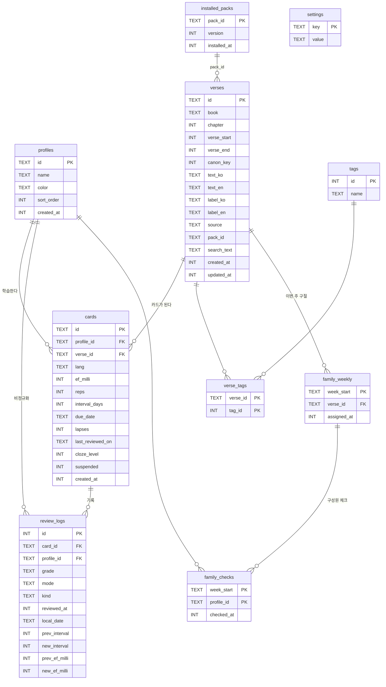

# Verse Keeper — 데이터 모델 (data-model.md)

> Stage 0 산출물 · 저장소: `expo-sqlite` (SDK 57, async API) · 파일: `verse-keeper.db`
> UI는 SQL을 직접 호출하지 않는다. `src/data/repositories/*`만 SQL을 알고, 화면은 hook(`src/features/*/use*.ts`)을 통해 repository를 호출한다.

> 💡 **웹 개발자 관점** — `expo-sqlite`는 브라우저 IndexedDB 대신 앱 샌드박스 안에 진짜 SQLite 파일을 둔다고 보면 된다. Firebase처럼 서버에 동기화되지 않고, 앱을 삭제하면 함께 지워진다(그래서 JSON 백업이 필요하다).

## 1. ERD



## 2. DDL (마이그레이션 v1)

```sql
-- 연결마다 실행 (PRAGMA foreign_keys는 연결 단위 설정이라 DB 파일에 저장되지 않는다)
PRAGMA journal_mode = WAL;
PRAGMA foreign_keys = ON;

CREATE TABLE profiles (
  id          TEXT PRIMARY KEY,                      -- UUID v4 (expo-crypto.randomUUID)
  name        TEXT NOT NULL CHECK (length(trim(name)) BETWEEN 1 AND 20),
  color       TEXT NOT NULL DEFAULT 'blue',          -- 팔레트 토큰 이름 (hex 아님 → 다크모드 대응)
  sort_order  INTEGER NOT NULL DEFAULT 0,
  created_at  INTEGER NOT NULL                       -- epoch ms
);

CREATE TABLE verses (
  id           TEXT PRIMARY KEY,                     -- 사용자: UUID / 팩: 'web-core-50:JHN.3.16' (안정 ID)
  book         TEXT NOT NULL,                        -- OSIS/USFM 3자 코드 (GEN … REV), 66권 목록은 domain 상수
  chapter      INTEGER NOT NULL CHECK (chapter >= 1),
  verse_start  INTEGER NOT NULL CHECK (verse_start >= 1),
  verse_end    INTEGER CHECK (verse_end IS NULL OR verse_end >= verse_start),
  canon_key    INTEGER NOT NULL,                     -- bookOrder*1_000_000 + chapter*1_000 + verse_start (성경 순서 정렬)
  text_ko      TEXT CHECK (text_ko IS NULL OR length(text_ko) <= 2000),
  text_en      TEXT CHECK (text_en IS NULL OR length(text_en) <= 2000),
  label_ko     TEXT,                                 -- 사용자가 적는 번역 이름 표시용(예: "내 번역"), 본문 아님
  label_en     TEXT,                                 -- 팩 구절은 'WEB'
  source       TEXT NOT NULL CHECK (source IN ('user','pack')),
  pack_id      TEXT REFERENCES installed_packs(pack_id) ON DELETE SET NULL,
  search_text  TEXT NOT NULL DEFAULT '',             -- NFC + 소문자: 참조 표시명(ko/en)+본문+태그. repository가 관리
  created_at   INTEGER NOT NULL,
  updated_at   INTEGER NOT NULL,
  CHECK (text_ko IS NOT NULL OR text_en IS NOT NULL)
);

CREATE TABLE tags (
  id    INTEGER PRIMARY KEY,
  name  TEXT NOT NULL UNIQUE COLLATE NOCASE CHECK (length(name) BETWEEN 1 AND 20)
);

CREATE TABLE verse_tags (
  verse_id  TEXT    NOT NULL REFERENCES verses(id) ON DELETE CASCADE,
  tag_id    INTEGER NOT NULL REFERENCES tags(id)   ON DELETE CASCADE,
  PRIMARY KEY (verse_id, tag_id)
) WITHOUT ROWID;

CREATE TABLE cards (
  id                TEXT PRIMARY KEY,
  profile_id        TEXT NOT NULL REFERENCES profiles(id) ON DELETE CASCADE,
  verse_id          TEXT NOT NULL REFERENCES verses(id)   ON DELETE CASCADE,
  lang              TEXT NOT NULL CHECK (lang IN ('ko','en')),
  ef_milli          INTEGER NOT NULL DEFAULT 2500 CHECK (ef_milli >= 1300),
  reps              INTEGER NOT NULL DEFAULT 0 CHECK (reps >= 0),
  interval_days     INTEGER NOT NULL DEFAULT 0 CHECK (interval_days BETWEEN 0 AND 365),
  due_date          TEXT NOT NULL,                   -- 'YYYY-MM-DD' 로컬 날짜
  lapses            INTEGER NOT NULL DEFAULT 0,
  last_reviewed_on  TEXT,
  cloze_level       INTEGER NOT NULL DEFAULT 1 CHECK (cloze_level BETWEEN 1 AND 5),
  suspended         INTEGER NOT NULL DEFAULT 0 CHECK (suspended IN (0,1)),
  created_at        INTEGER NOT NULL,
  UNIQUE (profile_id, verse_id, lang)
);

CREATE TABLE review_logs (
  id             INTEGER PRIMARY KEY AUTOINCREMENT,
  card_id        TEXT NOT NULL REFERENCES cards(id)    ON DELETE CASCADE,
  profile_id     TEXT NOT NULL REFERENCES profiles(id) ON DELETE CASCADE,
  grade          TEXT NOT NULL CHECK (grade IN ('again','hard','good','easy')),
  mode           TEXT NOT NULL CHECK (mode IN ('cloze','first_letter','listen')),
  kind           TEXT NOT NULL CHECK (kind IN ('review','practice')),
  reviewed_at    INTEGER NOT NULL,                   -- epoch ms (감사용)
  local_date     TEXT NOT NULL,                      -- 기록 시점 로컬 날짜 (streak 기준, 다시 해석하지 않음)
  prev_interval  INTEGER NOT NULL,
  new_interval   INTEGER NOT NULL,
  prev_ef_milli  INTEGER NOT NULL,
  new_ef_milli   INTEGER NOT NULL
);

CREATE TABLE family_weekly (
  week_start   TEXT PRIMARY KEY,                     -- 'YYYY-MM-DD' (주 시작일)
  verse_id     TEXT NOT NULL REFERENCES verses(id) ON DELETE CASCADE,
  assigned_at  INTEGER NOT NULL
);

CREATE TABLE family_checks (
  week_start  TEXT NOT NULL REFERENCES family_weekly(week_start) ON DELETE CASCADE,
  profile_id  TEXT NOT NULL REFERENCES profiles(id)             ON DELETE CASCADE,
  checked_at  INTEGER NOT NULL,
  PRIMARY KEY (week_start, profile_id)
) WITHOUT ROWID;

CREATE TABLE settings (
  key    TEXT PRIMARY KEY,
  value  TEXT NOT NULL                               -- JSON 인코딩 값
) WITHOUT ROWID;

CREATE TABLE installed_packs (
  pack_id       TEXT PRIMARY KEY,
  version       INTEGER NOT NULL,
  installed_at  INTEGER NOT NULL
);

-- 인덱스
CREATE INDEX idx_cards_due        ON cards (profile_id, suspended, due_date);   -- 오늘 배지 · 복습 큐
CREATE INDEX idx_cards_verse      ON cards (verse_id);                          -- FK cascade, 상세 화면
CREATE INDEX idx_logs_profile_day ON review_logs (profile_id, local_date);      -- streak
CREATE INDEX idx_logs_card        ON review_logs (card_id);                     -- FK cascade, 카드 이력
CREATE INDEX idx_verses_canon     ON verses (canon_key);                        -- 성경 순서 정렬
CREATE INDEX idx_verses_created   ON verses (created_at DESC);                  -- 최근 추가순 정렬
CREATE INDEX idx_verse_tags_tag   ON verse_tags (tag_id);                       -- 태그 필터
CREATE INDEX idx_family_verse     ON family_weekly (verse_id);                  -- FK cascade
```

### 2.1 설계 결정

| 결정 | 이유 |
|---|---|
| 카드 = (프로필, 구절, 언어) | 한국어와 영어 암송은 기억 강도가 다르다. 가족 구성원마다 진도가 다르다 |
| 구절은 기기 공유, 카드는 프로필별 | 한 기기를 가족이 함께 쓰는 시나리오. 같은 구절을 중복 입력하지 않는다 |
| 날짜는 `TEXT 'YYYY-MM-DD'` | 타임존과 무관한 달력 날짜. 문자열 비교 = 날짜 비교 |
| `ef_milli` 정수 | 부동소수점 오차 제거 ([algorithms.md](./algorithms.md) §1.1) |
| UUID(TEXT) PK | 백업 가져오기와 향후 병합 기능에서 ID 충돌 방지. `expo-crypto.randomUUID()`는 암호화가 아니라 난수 생성이므로 수출 규정 면제와 충돌하지 않음 |
| `search_text` 비정규화 | 구절 1,000개 수준에서는 `LIKE '%q%'`로 충분하다. FTS5는 한국어 토큰화 문제와 복잡도 때문에 쓰지 않음 |
| `review_logs.profile_id` 비정규화 | streak 쿼리에서 JOIN 제거 |
| 설정 = key/value JSON | 스키마 변경 없이 설정 추가 |

### 2.2 설정 키

| key | 기본값 | 설명 |
|---|---|---|
| `onboarding.done` | `false` | |
| `profile.activeId` | 첫 프로필 | |
| `ui.language` | `"system"` | `system \| ko \| en` |
| `ui.theme` | `"system"` | `system \| light \| dark` |
| `ui.haptics` | `true` | |
| `review.sessionSize` | `20` | 5~100 |
| `cloze.contentFirst` | `true` | |
| `cloze.showLength` | `true` | |
| `hint.koRule` | `"syllable"` | `syllable \| choseong` ([open-questions.md](./open-questions.md) Q2) |
| `listen.rate` | `1.0` | 0.5~1.5 |
| `listen.repeat` | `1` | 1~5 |
| `family.weekStartsOn` | `1` | 0=일 … 6=토 |
| `notify.enabled` | `false` | |
| `notify.time` | `"20:00"` | |
| `notify.scheduledId` | `null` | 예약된 로컬 알림 식별자 |

## 3. 대표 쿼리 (repository 내부)

```sql
-- 오늘 배지
SELECT COUNT(*) FROM cards WHERE profile_id = ? AND suspended = 0 AND due_date <= ?;

-- 복습 큐
SELECT c.*, v.* FROM cards c JOIN verses v ON v.id = c.verse_id
WHERE c.profile_id = ? AND c.suspended = 0 AND c.due_date <= ?
ORDER BY c.due_date, c.lapses DESC, c.verse_id, c.lang LIMIT ?;

-- streak용 학습일 (최근 400일이면 longest 계산에도 충분. 그보다 긴 기록은 settings에 longest 캐시)
SELECT DISTINCT local_date FROM review_logs WHERE profile_id = ? AND local_date >= ? ORDER BY local_date DESC;

-- 평가 1건 저장 = 한 트랜잭션
BEGIN; UPDATE cards SET … WHERE id = ?; INSERT INTO review_logs …; COMMIT;
```

`EXPLAIN QUERY PLAN`으로 배지·큐·streak 쿼리가 인덱스를 타는지 Stage 1 repository 테스트에서 확인한다.

## 4. 마이그레이션 전략

> 💡 **웹 개발자 관점** — Firebase는 스키마가 없지만, SQLite는 테이블 구조가 파일에 고정되어 있다. 앱 업데이트로 컬럼을 추가하려면 사용자 기기에 이미 있는 DB를 "버전 N → N+1"로 변환하는 스크립트가 필요하다. 그 버전 번호를 DB 파일 헤더의 `PRAGMA user_version`에 저장한다.

```ts
// src/data/db/migrations/index.ts
export interface Migration { version: number; name: string; up(tx: SqlExecutor): Promise<void> }
export const MIGRATIONS: Migration[] = [ { version: 1, name: 'init', up: m001_init } ];

// src/data/db/migrate.ts
export async function migrate(db: SqlExecutor, migrations = MIGRATIONS): Promise<{ from: number; to: number }>
```

규칙:
1. 시작할 때 `PRAGMA user_version`을 읽는다(`current`).
2. `current > 최신 버전`(앱을 이전 버전으로 되돌린 경우) → `DB_NEWER_THAN_APP` 오류 화면을 띄우고 데이터는 건드리지 않는다.
3. `version > current`인 마이그레이션을 오름차순으로 **각각 별도 트랜잭션**에서 실행한다: `BEGIN IMMEDIATE → up() → PRAGMA user_version = v → COMMIT`. 실패하면 `ROLLBACK`하고 해당 버전에서 멈춘 뒤 오류 화면을 띄운다(이전 버전까지는 이미 커밋됨).
4. 마이그레이션 파일은 **추가만** 한다. 이미 배포한 마이그레이션은 수정하지 않는다.
5. 버전 목록은 1부터 빈틈없이 연속해야 한다(`MIGRATIONS` 검증 테스트).
6. 백업 JSON의 `schemaVersion`은 DB `user_version`과 같은 번호 체계를 쓰고, 백업 마이그레이터(`migrateBackup`)도 버전마다 하나씩 둔다.
7. 기본 팩 설치·업데이트는 마이그레이션과 분리한다: `installed_packs.version < 번들 팩 version`이면 팩 구절만 upsert한다(사용자 입력 필드 `text_ko`, `label_ko`, 태그는 보존).

### 4.1 테스트 방식

- `SqlExecutor` 인터페이스(`execAsync`, `runAsync`, `getAllAsync`, `getFirstAsync`, `withTransactionAsync`)는 expo-sqlite의 부분 집합이다.
- **Jest에서는 Node 22 내장 `node:sqlite`(SQLite 3.51)로 이 인터페이스를 구현한 어댑터**를 써서, 모킹이 아닌 실제 SQL로 repository와 마이그레이션을 테스트한다. 앱 런타임에는 포함되지 않는 dev 전용 코드다.
- 앱에서는 expo-sqlite `SQLiteDatabase`가 그대로 이 인터페이스를 만족한다.

## 5. 백업 JSON 형식 (schemaVersion 1)

```jsonc
{
  "app": "verse-keeper",
  "schemaVersion": 1,
  "appVersion": "1.0.0",
  "exportedAt": "2026-09-25T11:00:00.000Z",
  "data": {
    "profiles": [ … ], "verses": [ … ], "tags": [ … ], "verseTags": [ … ],
    "cards": [ … ], "reviewLogs": [ … ], "familyWeekly": [ … ], "familyChecks": [ … ],
    "settings": { "ui.theme": "dark", … },          // notify.* 는 제외(기기마다 권한이 다름)
    "installedPacks": [ … ]
  }
}
```
- 가져오기는 **전체 교체** 방식이다(병합 없음 — 충돌 규칙이 모호해 데이터 손상 위험이 큼). 교체 뒤 알림 설정은 꺼짐으로 초기화된다.
- 팩 구절도 백업에 포함한다(버전이 다른 앱 사이에서 참조 무결성을 지키기 위해).

## 6. 기본 팩 JSON 형식 (`assets/packs/web-core-50.json`)

```jsonc
{
  "packId": "web-core-50",
  "version": 1,
  "translation": {
    "code": "WEB",
    "name": "World English Bible",
    "license": "Public Domain",
    "licenseNote": "The World English Bible is in the public domain. \"World English Bible\" is a trademark of eBible.org; this text is reproduced unmodified.",
    "source": "https://ebible.org/web/",
    "retrievedAt": "YYYY-MM-DD",
    "sourceSha256": "<원본 파일 해시>"
  },
  "verses": [
    { "id": "web-core-50:JHN.3.16", "book": "JHN", "chapter": 3, "verseStart": 16, "verseEnd": null,
      "textEn": "<WEB 원문>", "tags": ["gospel", "love"] }
  ]
}
```
- 팩 JSON은 `scripts/build-pack.ts`(개발 도구)로 생성하고, CI에서 스키마와 50개 개수, 중복 ID 여부를 검증한다.
- 태그는 영어 슬러그로 저장하고 UI에서 i18n으로 번역해 보여 준다.
